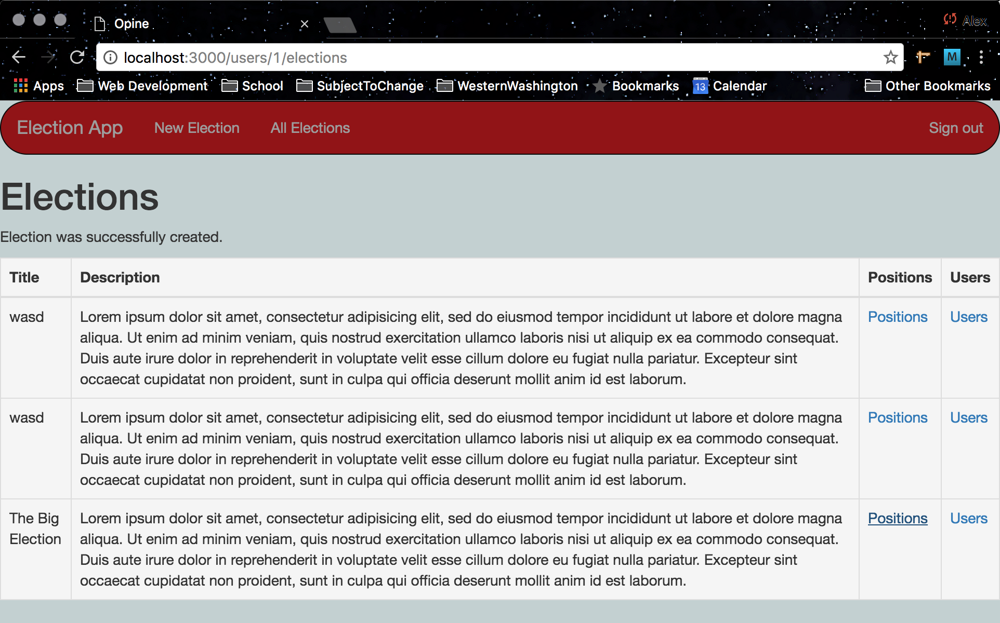
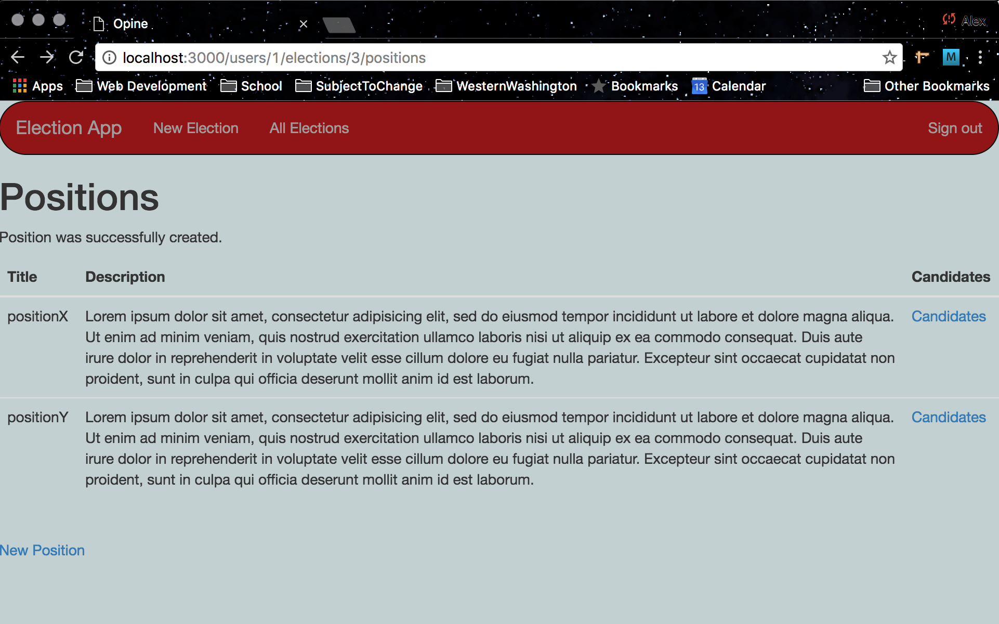
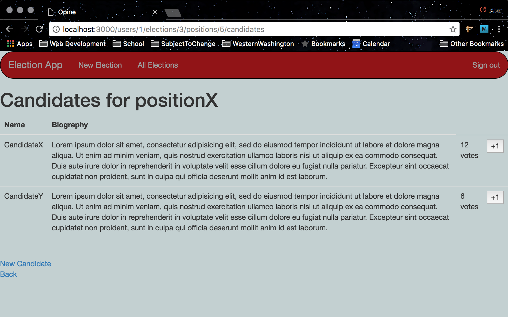
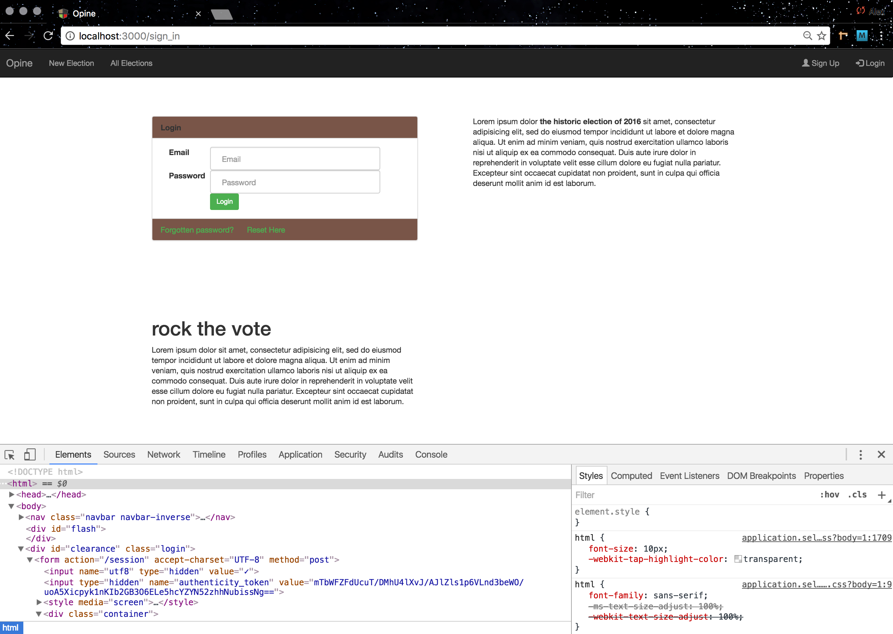
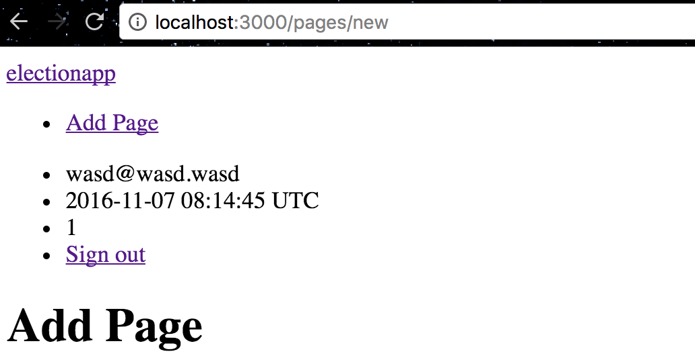

# Opine Election Application

Contributors :
* Alex(ander) Harris
* Alex Tomes
* Evan Carlin
* Michael Mulay

## Login Document Object Model Manipulation

## November 6th
All group members were present. Worked for 3 hours to configure git repository :
[Election Application GitHub Repository](https://github.com/electionapp/electionapp)

### Implemented :
* ruby clearance user authentication
* user add-page functionality

Nov. 8 image:

